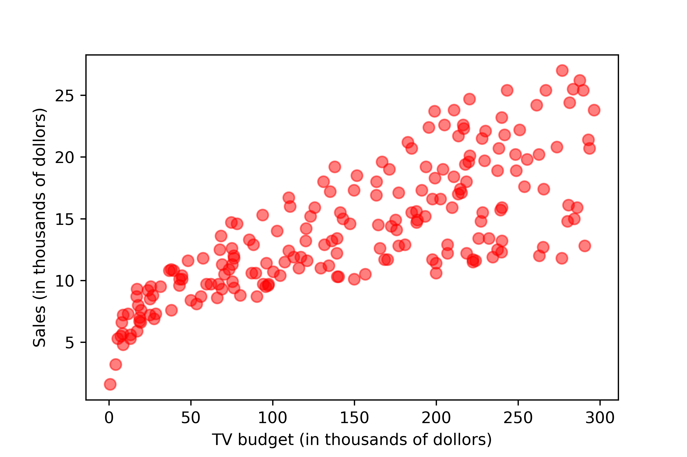

#############
Lecture notes
#############

..
    .. include:: intro-simple-linear-reg.rst

Introduction to linear regression
=================================

.. code-block:: python
    
    import pandas as pd
    import matplotlib.pyplot as plt
    df = pd.read_csv('./data/advertising.csv')
    plt.scatter(x='TV', y='sales', data=df)

Questions that we may ask

- Is there a relationship between advertising budget (TV, radio, and newspaper) and the sales?
- If yes, how *strong* is the relationship?
- Is the relationship *linear*?
- How *accurately* can we estimate the effect of each channel on sales?
- Given the budget, how accurately can we *predict* future sales?
- Is there any *synergy* among the media?

`Linear regression <https://en.wikipedia.org/wiki/Linear_regression>`__
: Study the relationship between two or more variables.

.. math:: \text{sales} = f(\text{TV}) = a + b \cdot \text{TV}

`Simple linear regression <https://en.wikipedia.org/wiki/Simple_linear_regression>`__
: The model takes the form

.. math:: Y= \beta_0 + \beta_1 \cdot x + \epsilon

where

- :math:`x`: a given input to the model
- :math:`\epsilon`: the error term modeled as a `normally-distributed <https://probstats.org/normal.html>`__ random variable :math:`\epsilon \sim \text{N}(0, \sigma^2)`
- :math:`\beta_0 \text{ and } \beta_1`: unknown parameters in the model

Question: Is :math:`Y` a random variable?

- What is the expected value of :math:`Y`?
- What is the variance of :math:`Y`?
- What distribution does :math:`Y` follow?

.. math:: Y \sim \text{N}(\beta_0 + \beta_1 x, \sigma^2)

- :math:`\beta_0`: the *intercept*, the expected value of :math:`Y` when :math:`x=0`.
- :math:`\beta_1`: the *slope*, the expected change of :math:`Y` per unit change of :math:`x`.

.. Visualize :math:`\beta_0` and :math:`\beta_1`

.. .center[]

Parameter estimation
====================

The problem
^^^^^^^^^^^

.. math:: \text{E}[\text{sales}] = \beta_0 + \beta_1 \cdot \text{TV}

.. .center[]

What would be our "best" estimates of :math:`\beta_0` and :math:`\beta_1`?
In other words, what it the model that fits the data the best?

Naturally, we may want to take a look at the "errors" that the model made in its responses (:math:`\hat{y}_i`) when compared with the actual data (:math:`y_i`) at each of the given input values :math:`x_i`.

.. .center[]

.. math:: e_i=y_i-\hat{y}_i=y_i-(\beta_0+\beta_1x_i), \; i=1, 2, \cdots, n.

In statistics, these "errors" are often called "residuals", as they are the *remaining* variations in the data (:math:`y_i`) that can not be explained by a statistical model.

Question: Can we use the *sum of all the residuals* as a metric to find the best model?

.. math:: e_1+e_2+\cdots+e_n

It is not a good idea, as the positive and negative residuals would cancel each other out. 

Instead, we square the residuals before summing them up. 
The result is called the `Residual Sum of Squares (RSS) <https://en.wikipedia.org/wiki/Residual_sum_of_squares>`__.

.. math:: 

    \begin{aligned}
    \text{RSS}&=e_1^2+e_2^2+\cdots+e_n^2 \\
    \\
    &=\sum_{i=1}^n e_i^2 \\
    \\
    &=\sum_{i=1}^n \big[y_i-(\beta_0+\beta_1 x_i)\big]^2 \\
    \end{aligned}

Ordinary Least Squares (OLS)
^^^^^^^^^^^^^^^^^^^^^^^^^^^^

Given :math:`n` pairs of data

.. math:: (x_1, y_1), (x_2, y_2), \cdots, (x_n, y_n)

We choose :math:`\beta_0` and :math:`\beta_1` such that the RSS is minimized. 

.. math:: \min_{\beta_0, \beta_1} \bigg\{ f(\beta_0, \beta_1)=\text{RSS}= \sum_{i=1}^n \big[y_i - (\beta_0 + \beta_1 x_i)\big]^2 \bigg\}

This method is called `Ordinary Least Squares (OLS) <https://en.wikipedia.org/wiki/Ordinary_least_squares>`__.

To find the minimum of the function :math:`f(\beta_0, \beta_1)`, we take partial derivatives of the function w.r.t. :math:`\beta_0` and :math:`\beta_1`, and set the derivatives to 0.

.. math:: 

    \begin{align}
    \frac{\partial f(\beta_0, \beta_1)}{\partial \beta_0} &= \sum2\big[y_i - (\beta_0 + \beta_1x_i)\big](-1)=0  \label{a}   \tag{1}\\
    \\
    \frac{\partial f(\beta_0, \beta_1)}{\partial \beta_1} &= \sum2\big[y_i - (\beta_0 + \beta_1x_i)\big](-x_i)=0 \label{b}  \tag{2}\\
    \end{align}

Then we can use linear algebra to solve for :math:`\beta_0` and :math:`\beta_1`.

From Eq. (:math:`\ref{a}`)

.. math::

    \begin{align}
    \sum y_i -\sum \hat{\beta}_0 - \sum \hat{\beta}_1 x_i &= 0 \\
    \\
    \sum y_i - n \hat{\beta}_0 - \hat{\beta}_1 \sum x_i &= 0 \\
    \\
    n \hat{\beta}_0 + \big(\sum x_i \big) \hat{\beta}_1  &= \sum y_i \label{c}  \tag{3}\\
    \end{align}

From Eq. (:math:`\ref{b}`)

.. math::

    \begin{align}
    \sum \big(x_i y_i - \hat{\beta}_0 x_i - \hat{\beta}_1 x_i^2 \big) &= 0 \\
    \\
    \sum x_i y_i - \hat{\beta}_0 \sum x_i - \hat{\beta}_1 \sum x_i^2 &= 0 \\
    \\
    \big(\sum x_i \big) \hat{\beta}_0 + \big(\sum x_i^2 \big) \hat{\beta}_1  &= \sum x_i y_i \label{d}  \tag{4}\\
    \end{align}

Now multiply both sides of Eq. (:math:`\ref{c}`) by :math:`\sum x_i`, and multiply both sides of Eq. (:math:`\ref{d}`) by :math:`n`, we have

.. math::

    \begin{align}
    n \big(\sum x_i \big) \hat{\beta}_0 + \big(\sum x_i \big)^2 \hat{\beta}_1  &= \sum x_i \sum y_i \label{e}  \tag{5}\\
    \\
    n \big(\sum x_i \big) \hat{\beta}_0 + n \big(\sum x_i^2 \big) \hat{\beta}_1 &= n \sum x_i y_i  \label{f}  \tag{6}\\
    \end{align}

Lastly, Subtract both sides of Eq. (:math:`\ref{e}`) from Eq. (:math:`\ref{f}`), we have

.. math::

    \begin{align}
    \bigg[n \sum x_i^2 - \big(\sum x_i \big)^2 \bigg] \hat{\beta}_1 &= n \sum x_i y_i - \sum x_i \sum y_i \\
    \\
    \hat{\beta}_1 &= \frac{n \sum x_i y_i - \sum x_i \sum y_i}{n \sum x_i^2 - \big(\sum x_i \big)^2} \\
    \end{align}

The intercept estimate :math:`\hat{\beta}_0` can be obtained from Eq. (:math:`\ref{c}`)

.. math::

    \hat{\beta}_0 = \frac{\sum y_i - \big(\sum x_i \big) \cdot \hat{\beta}_1}{n} = \frac{\sum y_i}{n} - \frac{\sum x_i}{n} \cdot \hat{\beta}_1 = \bar{y} - \bar{x} \cdot \hat{\beta}_1

where :math:`\bar{x}` and :math:`\bar{y}` are the sample means for :math:`x` and :math:`y` from the data. 

.. Calculus refresher
.. ^^^^^^^^^^^^^^^^^^

.. .. math:: 

..     \begin{aligned}
..     \frac{d}{dx}(c)&=0 \\
..     \\
..     \frac{d}{dx}(kx)&=k \\
..     \\
..     \frac{d}{dx}\big(x^2\big)&=2x
..     \end{aligned}

.. The chain rule:

.. .. math:: \frac{d}{dx}\bigg(f\big(g(x)\big)\bigg)=f'\big(g(x)\big)\cdot g'(x)

.. admonition:: OLS solution

    Given :math:`n` pairs of data :math:`(x_1, y_1), (x_2, y_2), \cdots, (x_n, y_n)`, the Ordinary Least Squares solution is

    .. math:: 

        \begin{aligned}
        \hat{\beta}_1 &=\frac{n\sum{x_i y_i}-\sum{x_i}\sum{y_i}}{n\sum{x_i^2}-(\sum{x_i})^2} =\frac{\sum{(x_i-\bar{x})(y_i-\bar{y})}}{\sum{(x_i-\bar{x})^2}} =\frac{S_{xy}}{S_{xx}}
        \\
        \\
        \hat{\beta}_0&=\bar{y}-\bar{x}\hat{\beta}_1 \\
        \end{aligned}

Some intuition

`Sample covariance <https://en.wikipedia.org/wiki/Covariance#Calculating_the_sample_covariance>`__

.. math:: \text{cov}(x, y)=\frac{\sum{(x_i-\bar{x})(y_i-\bar{y})}}{n-1}

`Sample variance <https://imse317.github.io/lectures/chap-1/measure-of-variability>`__

.. math:: \text{var}(x)=\text{cov}(x, x)=\frac{\sum{(x_i-\bar{x})^2}}{n-1}

OLS slope estimate

.. math:: \hat{\beta}_1 = \frac{\sum{(x_i-\bar{x})(y_i-\bar{y})}}{\sum{(x_i-\bar{x})(x_i-\bar{x})}} =\frac{\text{cov}(x, y)}{\text{cov}(x, x)}

Roughly speaking, :math:`\hat{\beta}_1` measures how much two variables :math:`x` and :math:`y` vary together, relative to the variability of the independent variable :math:`x` itself. 

Further resources
^^^^^^^^^^^^^^^^^

- `Seeing Theory <https://seeing-theory.brown.edu/regression-analysis/>`__

Assessing the accuracy of the parameter estimates
=================================================

The slope estimator
^^^^^^^^^^^^^^^^^^^

From the OLS solution, we have

.. math:: 

    \hat{\beta}_1 =\frac{\sum{(x_i-\bar{x})(y_i-\bar{y})}}{\sum{(x_i-\bar{x})^2}}

If we replace :math:`\beta` with :math:`B` (indicating it's a random variable), and replace :math:`y` with :math:`Y`, 
we can write the OLS slope *estimator* :math:`\hat{B}_1` as

.. math:: 
    \hat{B}_1 =\frac{\sum(x_i-\bar{x})(Y_i-\bar{Y})}{\sum(x_i-\bar{x})^2}

Below we show that the slope estimator :math:`\hat{B}_1` follows a normal distribution with the following mean and variance. 

.. math:: 
    \hat{B}_1 \sim \text{N}\bigg(\beta_1, \frac{\sigma^2}{\sum (x_i - \bar{x})^2}\bigg)

To prove it we first show that :math:`\hat{B}_1` is a linear combination of :math:`\hat{Y}_i`'s.

.. admonition:: Theorem

    For :math:`n` sample data :math:`x_1, x_2, \cdots, x_n`, the sum of all deviations from the sample mean :math:`\bar{x}` is zero. 

    **Proof**:

    .. math:: 

         \sum (x_i - \bar{x}) = \sum x_i - \sum \bar{x} = \sum x_i - n \bar{x} = \sum x_i - n \frac{\sum x_i}{n} = \sum x_i - \sum x_i = 0

.. math:: 

    \begin{align}
    \hat{B}_1 &=\frac{\sum(x_i-\bar{x})(Y_i-\bar{Y})}{\sum(x_i-\bar{x})^2} \\
    \\
    &=\frac{\sum\big[(x_i-\bar{x})Y_i - (x_i-\bar{x})\bar{Y}\big]}{\sum(x_i-\bar{x})^2} \\
    \\
    &=\frac{\sum(x_i-\bar{x})Y_i - \sum(x_i-\bar{x})\bar{Y}}{\sum(x_i-\bar{x})^2} \\
    \\
    &=\frac{\sum(x_i-\bar{x})Y_i - \bar{Y}\sum(x_i-\bar{x})}{\sum(x_i-\bar{x})^2} \\
    \\
    &=\frac{\sum(x_i-\bar{x})Y_i - \bar{Y} \cdot 0}{\sum(x_i-\bar{x})^2} \\
    \\
    &=\frac{\sum(x_i-\bar{x})Y_i}{\sum(x_i-\bar{x})^2} \\
    \end{align}

.. admonition:: Theorem

    Any linear combination of independent normally distributed random variables also follows a normal distribution (`see proof <https://statproofbook.github.io/P/norm-lincomb>`__).

Since :math:`Y_i`'s are normally-distributed and independent of each other, :math:`\hat{B}_1`, a linear combination of :math:`Y_i`'s, follows a normal distribution.

Next, we show that the expected value of :math:`\hat{B}_1` is :math:`\beta_1`.

.. math:: 

    \begin{align}
    \text{E}[\hat{B}_1] &= \text{E}\bigg[\frac{\sum (x_i - \bar{x})Y_i}{\sum (x_i - \bar{x})^2}\bigg] \\
    \\
    &=\frac{\sum (x_i - \bar{x})\text{E}[Y_i]}{\sum (x_i - \bar{x})^2} \\
    \\
    &=\frac{\sum (x_i - \bar{x})(\beta_0+\beta_1 x_i)}{\sum (x_i - \bar{x})(x_i - \bar{x})} \\
    \\
    &=\frac{\sum (x_i - \bar{x})\beta_0 +\sum (x_i - \bar{x})\beta_1 x_i}{\sum (x_i - \bar{x})x_i - \sum (x_i - \bar{x})\bar{x}} \\
    \\
    &=\frac{\beta_0\sum (x_i - \bar{x}) + \beta_1 \sum (x_i - \bar{x}) x_i}{\sum (x_i - \bar{x})x_i - \bar{x}\sum (x_i - \bar{x})} \\
    \\
    &=\frac{\beta_0 \cdot 0 + \beta_1 \sum (x_i - \bar{x}) x_i}{\sum (x_i - \bar{x})x_i - \bar{x} \cdot 0} \\
    \\
    &=\frac{\beta_1 \sum (x_i - \bar{x}) x_i}{\sum (x_i - \bar{x})x_i} \\
    \\
    &=\beta_1
    \end{align}

When an estimator's expected value equals the true value of the parameter being estimated, we say that the estimator is `unbiased <https://en.wikipedia.org/wiki/Bias_of_an_estimator>`__.
From the above we show that the OLS slope parameter :math:`\hat{B}_1` is an *unbiased* estimator for the slope parameter :math:`\beta_1` in the simple linear regression model. 

Then, we show that the variance of :math:`\hat{B}_1` is :math:`\frac{\sigma^2}{\sum (x_i - \bar{x})^2}`.

.. math:: 

    \begin{align}
    \text{var}(\hat{B}_1) &= \text{var}\bigg(\frac{\sum (x_i - \bar{x})Y_i}{\sum (x_i - \bar{x})^2}\bigg) \\
    \\
    &= \frac{\sum (x_i - \bar{x})^2\text{var}(Y_i)}{(\sum (x_i - \bar{x})^2)^2} \\
    \\
    &= \frac{\sum (x_i - \bar{x})^2 \sigma^2}{(\sum (x_i - \bar{x})^2)^2} \\
    \\
    &= \frac{\sigma^2 \sum (x_i - \bar{x})^2 }{(\sum (x_i - \bar{x})^2)^2} \\
    \\
    &= \frac{\sigma^2}{\sum (x_i - \bar{x})^2} \\
    \end{align}

.. admonition:: Important

    The OLS slope estimator

    .. math:: 
        \hat{B}_1 \sim \text{N}\bigg(\beta_1, \frac{\sigma^2}{\sum (x_i - \bar{x})^2}\bigg)

In practice, we do not know :math:`\sigma`, the *true* standard deviation of the error term :math:`\epsilon` in the regression model. 
The best thing we can do is to estimate the variance from the data at hand. 

.. math:: 
        \hat{\sigma} = \text{RSE} = \sqrt{\frac{\text{RSS}}{n-2}}=\sqrt{\frac{\sum e_i^2}{n-2}}=\sqrt{\frac{\sum (y_i - \hat{y}_i)^2}{n-2}}

The *estimated* standard deviation :math:`\hat{\sigma}` is often called Residual Standard Error (RSE). 

After we replace :math:`\sigma` with :math:`\hat{\sigma}`, the variance of the slope estimator :math:`\hat{B}_1` becomes

.. math:: 
        \text{var}(\hat{B}_1) = \frac{\sigma^2}{\sum (x_i - \bar{x})^2} \approx \frac{\hat{\sigma}^2}{\sum (x_i - \bar{x})^2} = \frac{\text{RSS}}{(n-2)\sum (x_i - \bar{x})^2} 

Similarly, the standard deviation of the slope estimator :math:`\hat{B}_1`, often called the Standard Error (SE) of the estimator, become

.. math:: 
        \text{SE}(\hat{B}_1) = \sqrt{\frac{\sigma^2}{\sum (x_i - \bar{x})^2}} \approx \sqrt{\frac{\text{RSS}}{(n-2)\sum (x_i - \bar{x})^2}}

After replacing :math:`\sigma` with :math:`\hat{\sigma}`, the standardized version of the slope estimator :math:`\hat{B}_1` follows a `t-distribution <https://en.wikipedia.org/wiki/Student%27s_t-distribution>`__ with degree of freedom of :math:`n-2`.

Confidence interval
^^^^^^^^^^^^^^^^^^^

We can construct a confidence interval (at confidence level :math:`1-\alpha`) for the slope parameter :math:`\beta_1`.

.. math:: 

    \begin{align}
    \text{P}\bigg(-t_{\alpha/2, n-2} < \frac{\hat{B}_1 - \beta_1}{\text{SE}(\hat{B}_1)} < t_{\alpha/2, n-2}\bigg) &= 1-\alpha \\
    \\
    \text{P}\bigg(-t_{\alpha/2, n-2} \cdot \text{SE}(\hat{B}_1)  < \hat{B}_1 - \beta_1 < t_{\alpha/2, n-2} \cdot \text{SE}(\hat{B}_1)\bigg) &= 1-\alpha \\
    \\
    \text{P}\bigg(-\hat{B}_1 - t_{\alpha/2, n-2} \cdot \text{SE}(\hat{B}_1)  < - \beta_1 < - \hat{B}_1 + t_{\alpha/2, n-2} \cdot \text{SE}(\hat{B}_1)\bigg) &= 1-\alpha \\
    \\
    \text{P}\bigg(\hat{B}_1 - t_{\alpha/2, n-2} \cdot \text{SE}(\hat{B}_1)  < \beta_1 < \hat{B}_1 + t_{\alpha/2, n-2} \cdot \text{SE}(\hat{B}_1)\bigg) &= 1-\alpha \\
    \end{align}

Based on the above, we have the confidence interval (at confidence level :math:`1-\alpha`) for the slope parameter :math:`\beta_1` as

.. math:: 

    \bigg[\hat{\beta}_1- t_{\alpha/2, n-2} \cdot \text{SE}(\hat{B}_1),\;\; \hat{\beta}_1+ t_{\alpha/2, n-2} \cdot \text{SE}(\hat{B}_1)\bigg]

or simply

.. math:: 

    \hat{\beta}_1 \pm t_{\alpha/2, n-2} \cdot \text{SE}(\hat{B}_1)

where :math:`\hat{\beta}_1` is the OLS estimate of the slope parameter. 

Hypothesis test
^^^^^^^^^^^^^^^

- :math:`\text{H}_0`: There is *no* relationship between :math:`x` and :math:`y`.
- :math:`\text{H}_a`: There is *some* relationship between :math:`x` and :math:`y`.

Mathematically, this corresponds to

.. math:: 

    \begin{align}
        &\text{H}_0: \beta_1 = 0 \\
        \\
        &\text{H}_a: \beta_1 \neq 0 \\
    \end{align}

We compute a t-statistic, given by

.. math:: 

    t=\frac{\hat{\beta}_1 - \beta_1}{\text{SE}(\hat{B}_1)} = \frac{\hat{\beta}_1 - 0}{\text{SE}(\hat{B}_1)} = \frac{\hat{\beta}_1}{\text{SE}(\hat{B}_1)}

It measures the number of standard deviations that :math:`\hat{\beta}_1` is away from 0. 

If there really is no relationship between :math:`x` and :math:`y`, the t-statistic will have a t-distribution with the degree of freedom of :math:`n-2`.

We reject the null hypothesis :math:`\text{H}_0` if 

.. math:: 

    |t| > t_{\text{critical}}

or 

.. math:: 

    p\text{-value} = 2\cdot \text{P}(t_{n-2} > |t|) < \alpha

Roughly speaking, a small *p*-value means it's unlikely to observe such a relationship due to chance, if there really is *no* relationship. 

Equivalently, we can also check if the confidence interval for :math:`\beta_1` include 0.
If it does, it means the relationship is not significant. 

Assessing the accuracy of the model 
===================================

Once we reject the null hypothesis :math:`\text{H}_0` 
(i.e., stating that there *is* some relationship between :math:`x` and :math:`y`), 
we want to quantify the *extent* to which the model fits the data. 

A natural thought is to use something that measures the "average amount of errors" that the model made. 
The Residual Standard Error (RSE) that we used previously is such an measure. 

.. math:: 
        \text{RSE} = \sqrt{\frac{\text{RSS}}{n-2}}=\sqrt{\frac{\sum e_i^2}{n-2}}=\sqrt{\frac{\sum (y_i - \hat{y}_i)^2}{n-2}} =\sqrt{\frac{\sum \big(y_i - (\hat{\beta}_0 + \hat{\beta}_1 x_i)\big)^2}{n-2}}

RSE provides an *absolute* measure of the model's lack of fit. 
In the advertising example ``sales ~ TV``, the RSE is 3.26 (thousands of units). 
It can be interpreted as the actual sales in each market deviates from the true regression line (the model prediction) by 3,260 units, on average. 

One major limitation of using RSE as a measure of model accuracy is that it is not always clear what constitutes a "good" RSE. 
For example, is an average error of 3,260 units good?

:math:`R^2` statistic
^^^^^^^^^^^^^^^^^^^^^

Compare with the RSE, a more common metric to assess the model accuracy is the :math:`R^2` statistic (also called the *coefficient of determination*). 

We define the following:

RSS (Residual Sum of Squares)

.. math:: 

    \text{RSS}=\sum_{i=1}^n \big(y_i-\hat{y}_i \big)^2 \text{, where } \hat{y}_i = \hat{\beta}_0 + \hat{\beta}_1 x_i.

RSS measures the amount of variability in :math:`y` that is *left unexplained* after performing the regression on :math:`x`.

TSS (Total Sum of Squares)

.. math:: 

    \text{TSS}=\sum_{i=1}^n \big(y_i-\bar{y}_i \big)^2 \text{, where } \bar{y}_i = \frac{1}{n}\sum y_i \text{ is the sample mean for } y.

TSS measures the total amount of variability inherent in :math:`y` before performing the regression on :math:`x`.

:math:`\text{TSS}-\text{RSS}` measures the amount of variability in :math:`y` that is explained by performing the regression on :math:`x`.

.. math:: 

    R^2 = \frac{\text{TSS}-\text{RSS}}{\text{TSS}} = 1 - \frac{\text{RSS}}{\text{TSS}}

:math:`R^2` measures the *proportion* of variability in :math:`y` that is explained by performing the regression on :math:`x`.

In the advertising example ``sales ~ TV``, the :math:`R^2` is 0.612. 
It can be interpreted as 61.2% of the variability in the sales can be explained by a regression on the TV budget. 

Notes

- If a model is very accurate, the RSS will be much smaller when compared to TSS, which means the :math:`R^2` will be close to 1. 
- The definition of :math:`R^2` does not rely on any specific form of the model. In fact, it can be computed for *any* model with the output :math:`\hat{y}_i`. 
- For an OLS regression model, it can be proved that :math:`0 \leq R^2 \leq 1`. 
- Generally, :math:`R^2 \geq 0` does *not* hold. Think of an arbitrarily "bad" model.  

Predictions: Confidence and prediction intervals
================================================

Once we fit a regression model to the data, we can use the model to make predictions. 
For example, the model predicts that the sales would be 15,000 units with a TV budget of $100k. 
Often times, in addition to predict a single number of the sales, 
we want to quantify the uncertainty by constructing a interval in which we have high confidence the sales would fall in.

Theorems
^^^^^^^^

Previously, we know the OLS slope estimator :math:`\hat{B}_1` can be written as a linear combination of :math:`Y_i` and follows a normal distribution. 

.. math::

   \hat{B}_1 = \frac{\sum(x_i-\bar{x})Y_i}{\sum(x_i-\bar{x})^2} \sim \text{N}\bigg(\beta_1, \frac{\sigma^2}{S_{xx}}\bigg)

Now we take a look at the OLS intercept estimator :math:`\hat{B}_0`. 

.. math::

   \hat{B}_0 = \bar{Y} - \bar{x}\hat{B}_1

Below we prove that :math:`\hat{B}_0` also follows a normal distribution with the following mean and variance. 

.. math::

    \begin{align}
    \text{E}\big[\hat{B}_0\big] &= \text{E}\big[\bar{Y} - \bar{x}\hat{B}_1\big] \\
    \\
    &= \text{E}\big[\bar{Y}\big] - \bar{x}\text{E}\big[\hat{B}_1\big] \\
    \\
    &= \text{E}\bigg[\frac{1}{n}\sum Y_i\bigg] - \bar{x} \beta_1 \\
    \\
    &= \frac{1}{n}\sum\text{E}\big[ Y_i\big] - \bar{x} \beta_1 \\
    \\
    &= \frac{1}{n}\sum (\beta_0 + \beta_1 x_i) - \bar{x} \beta_1 \\
    \\
    &= \frac{1}{n}(n\beta_0 + \beta_1 \sum x_i) - \bar{x} \beta_1 \\
    \\
    &= \beta_0 + \beta_1 \frac{1}{n}  \sum x_i - \bar{x} \beta_1 \\
    \\
    &= \beta_0 + \beta_1 \bar{x} - \bar{x} \beta_1 \\
    \\
    &= \beta_0 \\
    \end{align}

The above result shows the OLS intercept estimator :math:`\hat{B}_0` is also `unbiased <https://en.wikipedia.org/wiki/Bias_of_an_estimator>`__.

.. math::

    \begin{align}
    \text{var}\big(\hat{B}_0\big) &= \text{var}\big(\bar{Y} - \bar{x}\hat{B}_1\big) \\
    \\
    &= \text{var}\big(\bar{Y}) + \text{var}\big(\bar{x}\hat{B}_1\big) - 2\text{cov}\big(\bar{Y}, \bar{x}\hat{B}_1\big)\\
    \\
    &= \text{var}\bigg(\frac{1}{n}\sum Y_i\bigg) + \bar{x}^2\text{var}\big(\hat{B}_1\big) - 2\bar{x}\text{cov}\big(\bar{Y}, \hat{B}_1\big)\\
    \\
    &= \frac{1}{n^2}\sum \text{var}\big( Y_i\big) + \bar{x}^2 \frac{\sigma^2}{S_{xx}} - 2\bar{x}\cdot 0 \\
    \\
    &= \frac{1}{n^2} n \sigma^2 + \bar{x}^2 \frac{\sigma^2}{S_{xx}} \\
    \\
    &= \sigma^2\bigg(\frac{1}{n}  + \frac{\bar{x}^2}{S_{xx}}\bigg) \\
    \end{align}

In the above proof, we used the fact that :math:`\text{cov}\big(\bar{Y}, \hat{B}_1\big)=0`. 
Below is its proof.

.. math::

    \begin{align}
    \text{cov}\big(\bar{Y}, \hat{B}_1\big) &= \text{cov}\bigg(\frac{1}{n}\sum_i Y_i, \hat{B}_1\bigg) \\
    \\
    &= \frac{1}{n}\text{cov}\big(\sum_i Y_i, \hat{B}_1\big) \\
    \\
    &= \frac{1}{n} \sum_i \text{cov}\big(Y_i, \hat{B}_1\big) \\
    \\
    &= \frac{1}{n} \sum_i \text{cov}\bigg(Y_i, \frac{\sum_j (x_j-\bar{x})Y_j}{S_{xx}}\bigg) \\
    \\
    &= \frac{1}{n S_{xx}} \sum_i \sum_j \text{cov}\big(Y_i, (x_j-\bar{x})Y_j\big) \\
    \\
    &\text{because $\text{cov}(Y_i, Y_i)=0$ when $i \neq j$ ($Y_i$ and $Y_i$ are independent), }\\
    \\
    &= \frac{1}{n S_{xx}} \sum_i (x_i-\bar{x}) \text{cov}(Y_i, Y_i) \\
    \\
    &= \frac{1}{n S_{xx}} \sum_i (x_i-\bar{x}) \text{var}(Y_i) \\
    \\
    &= \frac{1}{n S_{xx}} \sum_i (x_i-\bar{x}) \sigma^2 \\
    \\
    &= \frac{\sigma^2}{n S_{xx}} \sum_i (x_i-\bar{x})  \\
    \\
    &= \frac{\sigma^2}{n S_{xx}} \cdot 0  \\
    \\
    &= 0 \\
    \end{align}

Confidence interval
^^^^^^^^^^^^^^^^^^^

Previously, we compute the model prediction at a given :math:`x=x^*` using the formula below. 

.. math::

    \hat{y} = \hat{\beta}_0 + \hat{\beta}_1 x^*

If we describe the above as a general method of estimating :math:`y` at a given :math:`x=x^*`, we have the estimator for the mean response :math:`\hat{Y}_{\text{mean}, x=x^*}`, or simply :math:`\hat{Y}_{\text{mean}}` as follows.

.. math::

    \hat{Y}_{\text{mean}} = \hat{B}_0 + \hat{B}_1 x^*

Let's construct a confidence interval for :math:`\hat{Y}_{\text{mean}}`, the mean response for all observations at :math:`x=x^*`.

The expected value of :math:`\hat{Y}_{\text{mean}}`:

.. math::

    \begin{align}
    \text{E}\big[\hat{Y}_{\text{mean}} \big] &= \text{E}\big[\hat{B}_0 + \hat{B}_1 x^* \big] \\
    \\
    &= \text{E}\big[\hat{B}_0\big] + \text{E}\big[\hat{B}_1 x^* \big] \\
    \\
    &= \beta_0 + \beta_1 x^* \\
    \end{align}

The variance of :math:`\hat{Y}_{\text{mean}}`:

.. math::

    \begin{align}
    \text{var}\big(\hat{Y}_{\text{mean}} \big) &= \text{var}\big(\hat{B}_0 + \hat{B}_1 x^* \big) \\
    \\
    &=\text{var}\big(\hat{B}_0\big) + \text{var}\big(\hat{B}_1 x^* \big) + 2x^*\text{cov}\big(\hat{B}_0, \hat{B}_1 \big)\\
    \\
    &= \sigma^2\bigg(\frac{1}{n} + \frac{\bar{x}^2}{S_{xx}}\bigg) + (x^*)^2 \frac{\sigma^2}{S_{xx}} +2 x^* \text{cov}\big(\bar{Y} - \bar{x}\hat{B}_1, \hat{B}_1\big)\\
    \\
    &= \sigma^2\bigg(\frac{1}{n} + \frac{\bar{x}^2 + (x^*)^2 }{S_{xx}}\bigg) + 2 x^* \bigg[\text{cov}\big(\bar{Y}, \hat{B}_1 \big) - \bar{x}\text{cov}\big(\hat{B}_1, \hat{B}_1\big)\bigg]\\
    \\
    &= \sigma^2\bigg(\frac{1}{n} + \frac{\bar{x}^2 + (x^*)^2 }{S_{xx}}\bigg) + 2 x^* \big[0 - \bar{x}\text{var}\big(\hat{B}_1\big)\big]\\
    \\
    &= \sigma^2\bigg(\frac{1}{n} + \frac{\bar{x}^2 + (x^*)^2 }{S_{xx}}\bigg) - 2 x^* \bar{x}\frac{\sigma^2}{S_{xx}}\\
    \\
    &= \sigma^2\bigg(\frac{1}{n} + \frac{\bar{x}^2 + (x^*)^2 - 2 x^* \bar{x} }{S_{xx}}\bigg)\\
    \\
    &= \sigma^2\bigg(\frac{1}{n} + \frac{(x^* - \bar{x})^2}{S_{xx}}\bigg)\\
    \end{align}

The standard error of :math:`\hat{Y}_{\text{mean}}`:

.. math::

    \begin{align}
    \text{SE}\big(\hat{Y}_{\text{mean}}\big) &= \sqrt{\text{var}\big(\hat{Y}_{\text{mean}} \big)} \\
    \\
    &= \sqrt{\sigma^2\bigg(\frac{1}{n} + \frac{(x^* - \bar{x})^2}{S_{xx}}\bigg)} \\
    \\
    &= \sigma \sqrt{\frac{1}{n} + \frac{(x^* - \bar{x})^2}{S_{xx}}} \\
    \\
    &\approx \text{RSE} \sqrt{\frac{1}{n} + \frac{(x^* - \bar{x})^2}{S_{xx}}} \\
    \end{align}

After replacing :math:`\sigma` with RSE, the standardized version of :math:`\hat{Y}_{\text{mean}}` follow a *t*-distribution with a degree of freedom of :math:`n-2`.

.. math::

    \frac{\hat{Y}_{\text{mean}} - (\beta_0 + \beta_1 x^*)}{\text{SE}\big(\hat{Y}_{\text{mean}}\big)} \sim t_{n-2}

Using similar approach on constructing the confidence interval, we have the confidence interval (with confidence level :math:`1-\alpha`) for the mean response at :math:`x=x^*`:

.. math::

    \hat{\beta}_0 + \hat{\beta}_1 x^* \pm t_{\alpha/2, n-2} \cdot \text{SE}\big(\hat{Y}_{\text{mean}}\big)

.. note::

    - A confidence interval is used to quantify the uncertainty surrounding the **mean** response over a large number of observations, all at :math:`x=x^*`.
    - The confidence interval for the mean response (:math:`\hat{Y}_{\text{mean}} = \hat{B}_0 + \hat{B}_1 x^*`) captures the uncertainty when we estimate the model parameters (:math:`\beta_0 \text{ and } \beta_1`) based on data.

Prediction interval
^^^^^^^^^^^^^^^^^^^

We use a prediction interval to quantify the uncertainty surrounding the response for a *single* observation at :math:`x=x^*`.

The simple linear regression model takes the form:

.. math:: Y= \beta_0 + \beta_1 \cdot x + \epsilon

For a single observation the estimator of the response:

.. math:: \hat{Y} = \hat{B}_0 + \hat{B}_1 x^* + \epsilon = \hat{Y}_{\text{mean}} + \epsilon

Let's construct a confidence interval for :math:`\hat{Y}`, the response for a single observation at :math:`x=x^*`.

The expected value of :math:`\hat{Y}`:

.. math:: 
    
    \begin{align}
    \text{E}[\hat{Y}] &= \text{E}\big[\hat{Y}_{\text{mean}} + \epsilon \big] \\
    \\
    &= \text{E}\big[\hat{Y}_{\text{mean}}\big] + \text{E}[\epsilon] \\
    \\
    &= \beta_0 + \beta_1 x^* + 0 \\
    \\
    &= \beta_0 + \beta_1 x^* \\
    \end{align}

We see that :math:`\hat{Y}` and :math:`\hat{Y}_{\text{mean}}` have the same expected value of :math:`\beta_0 + \beta_1 x^*`, 
which is the *true* regression line's response at :math:`x=x^*`.

The variance of :math:`\hat{Y}`:

.. math::

    \begin{align}
    \text{var}\big(\hat{Y}\big) &= \text{var}\big(\hat{Y}_{\text{mean}} + \epsilon\big)\\
    \\
    &\text{Because the error $\epsilon$ from a new observation is independent to the mean}\\
    & \text{response estimator $\hat{Y}_{\text{mean}}$ which is built based on previous observations,} \\
    \\
    &= \text{var}\big(\hat{Y}_{\text{mean}}\big) + \text{var}(\epsilon) \\
    \\
    &= \text{var}\big(\hat{Y}_{\text{mean}}\big) + \sigma^2 \\
    \\
    &= \sigma^2\bigg(\frac{1}{n} + \frac{(x^* - \bar{x})^2}{S_{xx}}\bigg) + \sigma^2 \\
    \\
    &= \sigma^2\bigg(1 + \frac{1}{n} + \frac{(x^* - \bar{x})^2}{S_{xx}}\bigg) \\
    \end{align}

We see that the variance of :math:`\hat{Y}` is larger than the variance of :math:`\hat{Y}_{\text{mean}}` by  :math:`\sigma^2`.

The standard error of :math:`\hat{Y}`:

.. math::

    \begin{align}
    \text{SE}\big(\hat{Y}\big) &= \sqrt{\text{var}\big(\hat{Y}\big)} \\
    \\
    &= \sqrt{\sigma^2\bigg(1 + \frac{1}{n} + \frac{(x^* - \bar{x})^2}{S_{xx}}\bigg)} \\
    \\
    &= \sigma \sqrt{1 + \frac{1}{n} + \frac{(x^* - \bar{x})^2}{S_{xx}}} \\
    \\
    &\approx \text{RSE} \sqrt{1 + \frac{1}{n} + \frac{(x^* - \bar{x})^2}{S_{xx}}} \\
    \end{align}

After replacing :math:`\sigma` with RSE, the standardized version of :math:`\hat{Y}` follow a *t*-distribution with a degree of freedom of :math:`n-2`.

.. math::

    \frac{\hat{Y} - (\beta_0 + \beta_1 x^*)}{\text{SE}\big(\hat{Y}\big)} \sim t_{n-2}

Using similar approach, we have the prediction interval (with confidence level :math:`1-\alpha`) for the response to a single observation at :math:`x=x^*`:

.. math::

    \hat{\beta}_0 + \hat{\beta}_1 x^* \pm t_{\alpha/2, n-2} \cdot \text{SE}\big(\hat{Y}\big)

.. note::

    - A prediction interval is used to quantify the uncertainty surrounding the response for a **single** observation at :math:`x=x^*`.
    - From the formula we see the prediction interval is always wider than the confidence interval. 
    - The prediction interval (:math:`\hat{Y} = \hat{B}_0 + \hat{B}_1 x^* + \epsilon`) not only captures the uncertainty when we estimate the model parameters (:math:`\beta_0 \text{ and } \beta_1`), but also the additional uncertainty (:math:`\epsilon`) associated with making prediction for a *single* observation. 

Multiple linear regression
==========================

Introduction
^^^^^^^^^^^^

For the advertising data set, if we want to examine the relationship between all the three media budgets and the sales, 
we can build three simple linear regression models. 

.. math::

    \begin{align}
    \text{sales} &= \beta_0 + \beta_1 \cdot \text{TV} + \epsilon \\
    \\
    \text{sales} &= \beta_0 + \beta_1 \cdot \text{radio} + \epsilon \\
    \\
    \text{sales} &= \beta_0 + \beta_1 \cdot \text{newspaper} + \epsilon \\
    \end{align}

However, a better approach would be to build one linear regression model that incorporating all the three media. 
We can give each independent variable a separate slope parameter. 

.. math:: 
    
    \text{sales} = \beta_0 + \beta_1 \cdot \text{TV} + \beta_2 \cdot \text{radio} + \beta_3 \cdot \text{newspaper}+ \epsilon

This is called a *multiple* linear regression model, as there are multiple independent variables in the model. 

In general, a multiple linear regression model takes the form:

.. math:: 
    
    Y = \beta_0 + \beta_1 x_1 + \beta_2 x_2 + \cdots + \beta_p x_p + \epsilon

where

- :math:`x_1, x_2, \cdots, x_p` are :math:`p` independent variables;
- :math:`\beta_i` is the slope parameter associated with independent variable :math:`x_i` where :math:`i=1, 2, \cdots, p`;
- :math:`\beta_0` is the intercept parameter;
- :math:`\epsilon` is the same error term in the simple linear regression that followings a normal distribution with a mean of 0 and variance of :math:`\sigma^2`.
- :math:`Y` is the dependent variable.

As was the case in the simple linear regression, the model parameters (:math:`\beta_0, \beta_1, \beta_2, \cdots, \beta_p`) are unknown and need to be estimated based on data. 

We can see :math:`Y` is a normally-distributed random variable, as it is a normally-distributed random variable :math:`\epsilon` plus some non-random value. 

The expected value of :math:`Y`:

.. math::

    \begin{align}
    \text{E}[Y] &= \text{E}[\beta_0 + \beta_1 x_1 + \beta_2 x_2 + \cdots + \beta_p x_p + \epsilon] \\
    \\
    &= \text{E}[\beta_0 + \beta_1 x_1 + \beta_2 x_2 + \cdots + \beta_p x_p] + \text{E}[\epsilon] \\
    \\
    &= \beta_0 + \beta_1 x_1 + \beta_2 x_2 + \cdots + \beta_p x_p + 0 \\
    \\
    &= \beta_0 + \beta_1 x_1 + \beta_2 x_2 + \cdots + \beta_p x_p \\
    \end{align}

Interpretations of the model parameters

- The intercept parameter :math:`\beta_0` can be interpreted as the expected value of :math:`Y` when :math:`x_1=x_2=\cdots=x_p=0`.
- The slope parameter :math:`\beta_i` can be interpreted as the expected change of :math:`Y` per unit change of :math:`x_i`, *holding all other independent variables fixed*. 

The variance of :math:`Y`:

.. math::

    \begin{align}
    \text{var}(Y) &= \text{var}(\beta_0 + \beta_1 x_1 + \beta_2 x_2 + \cdots + \beta_p x_p + \epsilon) \\
    \\
    &= \text{var}(\epsilon) \\
    \\
    &= \sigma^2
    \end{align}

In summary, we have

.. math:: Y \sim \text{N}(\beta_0 + \beta_1 x_1 + \beta_2 x_2 + \cdots + \beta_p x_p, \;\sigma^2)

Parameter estimation
^^^^^^^^^^^^^^^^^^^^

Previously for simple linear regression, we used a method called Ordinary Least Squares (OLS) that finds the parameters that minimizes the RSS (residual sum of squares). 
For multiple linear regression we used the same approach. 
We choose :math:`\hat{\beta}_0, \hat{\beta}_1, \cdots, \hat{\beta}_p` such that the RSS is minimized. 

.. math:: \min_{\beta_0, \beta_1, \cdots, \beta_p} \bigg\{ f(\beta_0, \beta_1, \cdots, \beta_p)=\text{RSS}= \sum \big[y_i - (\beta_0 + \beta_1 x_1 + \cdots + \beta_p x_p )\big]^2 \bigg\}

The above minimization problem can be solved using the method Maximum Likelihood Estimate (MLE). 
The form of the solution is somewhat complex. 
In this course we rely on software packages such as the ``statsmodels`` library in Python to compute the solution for us. 

Model utility test
^^^^^^^^^^^^^^^^^^

With a fitted multiple linear regression model, the first question we may ask is "*Is the model useful at all?*"
We can answer this question by a hypothesis test called *model utility test* or F-test.

- :math:`\text{H}_0`: The model is *not* useful at all.
- :math:`\text{H}_a`: The model is at least somewhat useful.

Mathematically, this corresponds to

.. math:: 

    \begin{align}
        &\text{H}_0: \beta_1 = \beta_2 = \cdots = \beta_p = 0 \\
        \\
        &\text{H}_a: \text{at least one } \beta_j \text{ is not zero.} \\
    \end{align}

We compute the F-statistic

.. math:: F = \frac{(\text{TSS}-\text{RSS})/p}{\text{RSS}/(n-p-1)}

- The numerator :math:`(\text{TSS}-\text{RSS})/p` measures the variability that can be explained by the model. 
- The denominator :math:`\text{RSS}/(n-p-1)` measures the variability that can *not* be explained by the model. 

Roughly speaking, if a model is useful, the RSS is small, and the F-statistic is large. 

If the null hypothesis :math:`H_0` is true, the F-statistic follows a `F-distribution <https://en.wikipedia.org/wiki/F-distribution>`__ with degrees of freedom of :math:`p` and :math:`n-p-1`. 
We reject the null hypothesis if the F-statistic is greater than the critical value :math:`F_{\alpha, p, n-p-1}`.
Otherwise, we fail to reject the null hypothesis.
Equivalently, we reject the null hypothesis if the *p*-value is less than the significant level :math:`\alpha`.

.. list-table:: ANOVA (Analysis of variance) table
   :widths: 15 15 30 30 30
   :header-rows: 1

   * - 
     - df
     - Sum of squares
     - Mean squares
     - F
   * - Regression
     - :math:`p`
     - :math:`\text{TSS} - \text{RSS}`
     - :math:`(\text{TSS} - \text{RSS})/p`
     - :math:`F=\frac{(\text{TSS}-\text{RSS})/p}{\text{RSS}/(n-p-1)}`
   * - Residual
     - :math:`n-p-1`
     - :math:`\text{RSS}=\sum (y_i-\hat{y}_i)^2`
     - :math:`\text{RSS}/(n-p-1)`
     - :math:`-`
   * - Total
     - :math:`n-1`
     - :math:`\text{TSS}=\sum (y_i-\bar{y})^2`
     - :math:`-`
     - :math:`-`

*t*-test
^^^^^^^^

If a multiple linear regression model passes the :ref:`model utility test`,
and we conclude that the model is at least somewhat useful, 
naturally, our next question is *which subset of the independent variables are useful*?
We can perform a *t*-test to examine whether a specific independent variable (let's call it :math:`x_j`) is useful in predicting the dependent variable :math:`y`.

- :math:`\text{H}_0`: There is *no* relationship between :math:`x_j` and :math:`y`.
- :math:`\text{H}_a`: There is *some* relationship between :math:`x_j` and :math:`y`.

Mathematically, this corresponds to

.. math:: 

    \begin{align}
        &\text{H}_0: \beta_j = 0 \\
        \\
        &\text{H}_a: \beta_j \neq 0 \\
    \end{align}

We compute a t-statistic, given by

.. math:: 

    t=\frac{\hat{\beta}_j - \beta_j}{\text{SE}(\hat{B}_j)} = \frac{\hat{\beta}_j - 0}{\text{SE}(\hat{B}_j)} = \frac{\hat{\beta}_j}{\text{SE}(\hat{B}_j)}

If there really is no relationship between :math:`x_j` and :math:`y`, the t-statistic will have a t-distribution with the degree of freedom of :math:`n-p-1`.

We reject the null hypothesis :math:`\text{H}_0` if 

.. math:: 

    |t| > t_{\text{critical}}

or 

.. math:: 

    p\text{-value} = 2\cdot \text{P}(t_{n-p-1} > |t|) < \alpha

We can also construct a confidence interval for each slope parameter :math:`\beta_j`:

.. math::

    \hat{\beta}_j \pm t_{\alpha/2, n-p-1} \cdot \text{SE}(\hat{B}_j)

Equivalently, we can also check if the confidence interval for :math:`\beta_j` include 0.
If it does, it means the relationship is not significant. 

Note the above parts are very similar to the :ref:`Hypothesis test` when we discussed simple linear regression in the earlier sections,
with the only exception of the degree of freedom of the *t*-distribution now being :math:`n-p-1`.
We can also see the simply linear regression as a special case of multiple linear regression where the number of independent variables :math:`p=1`.

Similar to earlier we skipped the manual calculation of the OLS solution for the slope parameter :math:`\beta_j`,
We skip the calculation of the :math:`\text{SE}(\hat{B}_j)` and rely on software packages such as the ``statsmodels`` library in Python to compute the solutions for us. 

Accessing model accuracy
^^^^^^^^^^^^^^^^^^^^^^^^

For simple linear regression, we can use RSE (residual standard error) as a measure of model accuracy. 

.. math:: 
        \text{RSE} = \sqrt{\frac{\text{RSS}}{n-2}}

For multiple regression model, we can also compute the RSE with an adjustment to the degree of freedom in the above formula. 

.. math:: 
        \text{RSE} = \sqrt{\frac{\text{RSS}}{n-p-1}}

Again, the formula above for simple linear regression can be seen as a special case of multiple linear regression when the number of independent variables :math:`p=1`.

Similar to the arguments from the simple linear regression, RSE is an *absolute* measure of the model's lack of fit.  
More commonly, we use the :math:`R^2` statistic to measure the model's accuracy. 

.. math:: 

    R^2 = \frac{\text{TSS}-\text{RSS}}{\text{TSS}} = 1 - \frac{\text{RSS}}{\text{TSS}}

:math:`R^2` measures the *proportion* of variability in :math:`y` that is explained by performing the regression on all the independent variables :math:`x_1, x_2, \cdots, x_p`.

Previously, we showed that in the advertising example if we build a simple linear regression ``sales ~ TV``, the :math:`R^2` is 0.612. 
With a multiple linear regression ``sales ~ TV + radio + newspaper``, the :math:`R^2` is 0.897, which is an improvement in model accuracy after including the two additional independent variables. 

Confidence and prediction intervals
^^^^^^^^^^^^^^^^^^^^^^^^^^^^^^^^^^^

Once we build a multiple linear regression model, how can we use the model to make a prediction?
And how *accurate* is the prediction?

To make a prediction at a particular observation of the :math:`p` independent variables (:math:`x_1 = x_1^*, x_2 = x_2^*, \cdots, x_p = x_p^*`), 
we use the following formula based on the OLS solution of the parameter estimates (:math:`\hat{\beta}_0, \hat{\beta}_1, \hat{\beta}_2, \cdots, \hat{\beta}_p`). 

.. math::

    \hat{y} = \hat{\beta}_0 + \hat{\beta}_1 x_1^* + \hat{\beta}_2 x_2^* + \cdots + \hat{\beta}_p x_p^*

Similar to our discussion during the simple linear regression, to construct the confidence interval of the mean response we need to study the mean response estimator

.. math::

    \hat{Y}_{\text{mean}} = \hat{B}_0 + \hat{B}_1 x_1 + \hat{B}_2 x_2 + \cdots + \hat{B}_p x_p

Skipping the details, we can show that the confidence interval of the mean is 

.. math::

    \hat{\beta}_0 + \hat{\beta}_1 x_1^* + \hat{\beta}_2 x_2^* + \cdots + \hat{\beta}_p x_p^* \;\pm\; t_{\alpha/2, n-p-1} \cdot \text{SE}(Y_{mean})

It is a confidence interval of the *mean* response for *all* observations at :math:`x_1 = x_1^*, x_2 = x_2^*, \cdots, x_p = x_p^*`.

Similarly, we can construct a prediction interval for a *single* observation at :math:`x_1 = x_1^*, x_2 = x_2^*, \cdots, x_p = x_p^*`.

The single response estimator

.. math::

    \begin{align}
    \hat{Y} &= \hat{B}_0 + \hat{B}_1 x_1 + \hat{B}_2 x_2 + \cdots + \hat{B}_p x_p + \epsilon \\
    \\
    &= \hat{Y}_{\text{mean}} + \epsilon
    \end{align}

We can show that

.. math::

    \begin{align}
    \text{E}\big[\hat{Y}\big] &= \text{E}\big[\hat{Y}_{\text{mean}} + \epsilon \big] \\
    \\
    &= \text{E}\big[\hat{Y}_{\text{mean}}\big] + \text{E}[\epsilon] \\
    \\
    &= \text{E}\big[\hat{Y}_{\text{mean}}\big] + 0 \\
    \\
    &= \hat{\beta}_0 + \hat{\beta}_1 x_1^* + \hat{\beta}_2 x_2^* + \cdots + \hat{\beta}_p x_p^* \\
    \end{align}

And

.. math::

    \begin{align}
    \text{var}\big(\hat{Y}\big) &= \text{var}\big(\hat{Y}_{\text{mean}} + \epsilon \big) \\
    \\
    &= \text{var}\big(\hat{Y}_{\text{mean}}\big) + \text{var}(\epsilon) \\
    \\
    &= \text{var}\big(\hat{Y}_{\text{mean}}\big) + \sigma^2 \\
    \end{align}

Skipping the details, we can show that the prediction interval is 

.. math::

    \hat{\beta}_0 + \hat{\beta}_1 x_1^* + \hat{\beta}_2 x_2^* + \cdots + \hat{\beta}_p x_p^* \;\pm\; t_{\alpha/2, n-p-1} \cdot \text{SE}(Y)

It is a confidence interval of the response for a *single* observation at :math:`x_1 = x_1^*, x_2 = x_2^*, \cdots, x_p = x_p^*`.

We rely on software packages such as the ``statsmodels`` library in Python to compute the confidence and prediction intervals for us. 

Interactions
============

In the previous advertising data example, we can build a multiple linear regression model 

.. math::
    \text{sales} = \beta_0 + \beta_1 \cdot \text{TV} + \beta_2 \cdot \text{radio} + \epsilon

After fitting a model based on the data, let's say we have the fitted model

.. math::

    \hat{\text{sales}} = 2.9211 + 0.0458 \cdot \text{TV} + 0.1880 \cdot \text{radio}

In the above model, for a 1-unit increase in the TV budget, the effect on the sales is 0.0458. 
Note this is always the case regardless of the level of the radio budget. 
Similarly, for a 1-unit increase in radio budget, the effect on the sales is 0.1880, regardless of the level of the TV budget. 
However, in reality maybe with a higher radio budget, the TV budget can be more effective (i.e., with a steeper slope).
In other words, maybe the effectiveness of the TV budget depends on the level of radio budget, 
or we say there may be "synergy" between the TV and radio budget.
In statistics, this "synergy" is called *interactions* among the independent variables.

We can model the (possible) interaction between the TV and radio budget by introducing an interaction term in the model with its own slope parameter. 

.. math::
    \text{sales} = \beta_0 + \beta_1 \cdot \text{TV} + \beta_2 \cdot \text{radio} \textcolor{red}{+ \beta_3 \cdot \text{TV} \cdot \text{radio}} + \epsilon

In the above model, the terms for TV and radio are called the *main* effect, 
and the term for :math:`\text{TV} \cdot \text{radio}` is called the *interaction* effect.

We can show that 

.. math::

    \begin{align}
    \text{sales} &= \beta_0 + \beta_1 \cdot \text{TV} + \beta_2 \cdot \text{radio} + \beta_3 \cdot \text{TV} \cdot \text{radio} + \epsilon \\
    \\
    &= \beta_0 + (\beta_1 + \beta_3 \cdot \text{radio}) \cdot \text{TV} + \beta_2 \cdot \text{radio} + \epsilon \\
    \\
    &= \beta_0 + \beta_1' \cdot \text{TV} + \beta_2 \cdot \text{radio} + \epsilon \\
    \\
    & \text{where $\beta_1' = \beta_1 + \beta_3 \cdot \text{radio}$}
    \end{align}

In the above model the effect of the TV budget on the sales is no longer constant, but depending on the level of radio budget. 
We can perform the same :ref:`*t*-test` to determine if the interaction effect is significant or not. 

Categorical predictor
=====================

A categorical predictor with two levels
^^^^^^^^^^^^^^^^^^^^^^^^^^^^^^^^^^^^^^^

In the customer credit data set there is a variable indicating whether a customer is a student ("Yes") or not ("No").
Intuitively, this piece of information may be helpful in predicting one's credit balance.
However, unlike all the independent variable we have seen so far, this variable does not take numerical values, but rather, two categories of either "Yes" or "No".
How can we incorporate this categorical variable into a regression model to predict the credit balance?

For a categorical variable that has two categories (e.g., "Yes" and "No", often referred to as having two "levels"),
we can create a dummy variable with values of either 0 (representing "No") or 1 (representing "Yes"). 

.. math::

    \text{student} =
    \begin{cases}
    0,& \text{if "No"}; \\
    1,& \text{if "Yes"}. \\
    \end{cases}

Then we include this dummy (binary) variable into the regression model just like we would for any numerical variables. 

.. math::

    \text{balance} = \beta_0 + \beta_1 \cdot \text{income} + \textcolor{red}{\beta_2 \cdot \text{student}} + \epsilon

Then 

.. math::

    \text{E[balance]} = \beta_0 + \beta_1 \cdot \text{income} + \beta_2 \cdot \text{student}

For non-students (i.e., :math:`\text{student}=0`) the regression line becomes

.. math::

    \begin{align}
    \text{E[balance]} &= \beta_0 + \beta_1 \cdot \text{income} + \beta_2 \cdot 0 \\
    \\
    &= \beta_0 + \beta_1 \cdot \text{income} \\
    \end{align}
    
For students (i.e., :math:`\text{student}=1`) the regression line becomes

.. math::

    \begin{align}
    \text{E[balance]} &= \beta_0 + \beta_1 \cdot \text{income} + \beta_2 \cdot 1 \\
    \\
    &= (\beta_0 + \beta_2) + \beta_1 \cdot \text{income} \\
    \end{align}

The above shows for both the students and non-students, the income have the same main effect (of :math:`\beta_1`) on the balance. 
The difference is the intercept. 
For a student and a non-student *with the same income*, the student's balance is :math:`\beta_2` higher [#]_ than the non-student. 
Often the category that is set to 0 in the dummy variable (the non-student in this case) is called the *baseline*.

A categorical predictor with more than two levels
^^^^^^^^^^^^^^^^^^^^^^^^^^^^^^^^^^^^^^^^^^^^^^^^^

In the customer credit data set there is a variable indicating a customer's ethnicity.
The variable has three categories (i.e., levels): African American, Asian, and Caucasian.

A natural thought may be to create a dummy variable that encodes the three ethnicity groups with values of 0, 1, and 2.
For example, we can create a dummy variable ``ethnicity``:

.. math::

    \text{ethnicity} =
    \begin{cases}
    0,& \text{if African American}; \\
    1,& \text{if Asian}; \\
    2,& \text{if Caucasian}. \\
    \end{cases}

Then we include this dummy variable into the regression model just like we would for any numerical variables. 

.. math::

    \text{balance} = \beta_0 + \beta_1 \cdot \text{income} + \textcolor{red}{\beta_2 \cdot \text{ethnicity}} + \epsilon

Then 

.. math::

    \text{E[balance]} = \beta_0 + \beta_1 \cdot \text{income} + \beta_2 \cdot \text{ethnicity}

For African American (i.e., :math:`\text{ethnicity}=0`) the regression line becomes

.. math::

    \begin{align}
    \text{E[balance]} &= \beta_0 + \beta_1 \cdot \text{income} + \beta_2 \cdot 0 \\
    \\
    &= \beta_0 + \beta_1 \cdot \text{income} \\
    \end{align}

For Asian (i.e., :math:`\text{ethnicity}=1`) the regression line becomes

.. math::

    \begin{align}
    \text{E[balance]} &= \beta_0 + \beta_1 \cdot \text{income} + \beta_2 \cdot 1 \\
    \\
    &= (\beta_0 + \beta_2) + \beta_1 \cdot \text{income} \\
    \end{align}

For Caucasian (i.e., :math:`\text{ethnicity}=2`) the regression line becomes

.. math::

    \begin{align}
    \text{E[balance]} &= \beta_0 + \beta_1 \cdot \text{income} + \beta_2 \cdot 2 \\
    \\
    &= (\beta_0 + 2\beta_2) + \beta_1 \cdot \text{income} \\
    \end{align}

The above three regression lines have the same slope of :math:`\beta_1`, 
but different intercepts of :math:`\beta_0`, :math:`\beta_0 + \beta_2`, and :math:`\beta_0 + 2\beta_2`.

This essentially assigns 
(1) a particular order of the three ethnicity groups, and 
(2) *equal distance* between African American and Asian, and between Asian and Caucasian who have the same income.
In reality, there is little reason to believe these assumptions are valid.

For this reason, a better way to include the Ethnicity variable into the model is to create not one, but two dummy (binary) variables. 

.. math::

    \text{asian} =
    \begin{cases}
    0,& \text{if Asian}; \\
    1,& \text{if not Asian}. \\
    \end{cases} \;\;\;\;
    \text{caucasian} =
    \begin{cases}
    0,& \text{if Caucasian}; \\
    1,& \text{if not Caucasian}. \\
    \end{cases}

In this setting we can encode the three ethnicity groups as shown the table below.
This method is called `One Hot Encoding <https://en.wikipedia.org/wiki/One-hot>`_.

.. list-table:: One Hot Encoding
   :widths: 40 30 30
   :header-rows: 1

   * - Categories \\ Dummy variables
     - :math:`\text{asian}`
     - :math:`\text{caucasian}`
   * - Asian
     - 1
     - 0
   * - Caucasian
     - 0
     - 1
   * - African American
     - 0
     - 0

After applying the above encoding, we include the two dummy variable into the regression model. 

.. math::

    \text{balance} = \beta_0 + \beta_1 \cdot \text{income} + \textcolor{red}{\beta_2 \cdot \text{asian} + \beta_3 \cdot \text{caucasian}} + \epsilon

Then 

.. math::

    \text{E[balance]} = \beta_0 + \beta_1 \cdot \text{income} + \beta_2 \cdot \text{asian} + \beta_3 \cdot \text{caucasian}

For African American (i.e., :math:`\text{asian}=0, \text{caucasian}=0`) the regression line becomes

.. math::

    \begin{align}
    \text{E[balance]} &= \beta_0 + \beta_1 \cdot \text{income} + \beta_2 \cdot 0 + \beta_3 \cdot 0 \\
    \\
    &= \beta_0 + \beta_1 \cdot \text{income} \\
    \end{align}

For Asian (i.e., :math:`\text{asian}=1, \text{caucasian}=0`) the regression line becomes

.. math::

    \begin{align}
    \text{E[balance]} &= \beta_0 + \beta_1 \cdot \text{income} + \beta_2 \cdot 1 + \beta_3 \cdot 0 \\
    \\
    &= (\beta_0 + \beta_2) + \beta_1 \cdot \text{income} \\
    \end{align}

For Caucasian (i.e., :math:`\text{asian}=0, \text{caucasian}=1`) the regression line becomes

.. math::

    \begin{align}
    \text{E[balance]} &= \beta_0 + \beta_1 \cdot \text{income} + \beta_2 \cdot 0 + \beta_3 \cdot 1 \\
    \\
    &= (\beta_0 + \beta_3) + \beta_1 \cdot \text{income} \\
    \end{align}

The above three regression lines have the same slope of :math:`\beta_1`, 
but different intercepts of :math:`\beta_0`, :math:`\beta_0 + \beta_2`, and :math:`\beta_0 + \beta_3`.
For the customers who have the same income, the distance between the African American (baseline) and Asian is :math:`\beta_2`,
and the distance between the African American (baseline) and Caucasian is :math:`\beta_3`.
This allows us to model these distances (which are likely different in reality) using two separate parameters.

In general, we need to create *one fewer* dummy binary variables than the number of levels in the categorical predictor. 

Similar to our discussion earlier on the interaction between the income and student, 
we can further add the interaction effect to model the different income slopes for different ethnicity groups. 

.. math::

    \begin{align}
    \text{balance} = \beta_0 &+ \beta_1 \cdot \text{income} \\
    &+ \beta_2 \cdot \text{asian} \\
    &+ \beta_3 \cdot \text{caucasian} \\
    &+ \beta_4 \cdot \text{income $\cdot$ asian} \\
    &+ \beta_5 \cdot \text{income $\cdot$ caucasian} \\
    &+ \beta_6 \cdot \text{asian $\cdot$ caucasian} \\
    &+ \beta_7 \cdot \text{income $\cdot$ asian $\cdot$ caucasian} \;\;\;\;\textcolor{gray}{\rightarrow\text{3-way interactions}}\\
    &+ \epsilon \\
    \end{align}

.. rubric:: Footnotes

.. [#] Note :math:`\beta_2` may be negative. 

Non-linear relationship
=======================

Question: Is the model below a linear regression model?

.. math::

    Y = \beta_0 + \beta_1 x + \beta_2 x^2 + \epsilon

Let :math:`x_1=x, x_2=x^2`, we have

.. math::

    Y = \beta_0 + \beta_1 x_1 + \beta_2 x_2 + \epsilon

After the transformation the model become a linear regression model. 
If this is the case, we say the original model is *intrinsically* linear. 

.. note::

    The word "linear" in linear regression model does not mean the independent variables are linear. 
    Rather, it means the regression coefficients (:math:`\beta_0, \beta_1, \beta_2`, etc.) are linear. 

Question: Are the models below a linear regression model?

.. math::

    \begin{align}
    Y &= \beta_0 + \beta_1 x_1 + \beta_1^2 x_2 + \epsilon \\
    \\
    Y &= \beta_0 + \beta_1 x_1 + \beta_0 \beta_1 x_2 + \epsilon \\
    \end{align}

Answer: They are not, as the regression coefficients are not linear. 

Examples of other intrinsically linear models:

Example 1:

.. math::

    Y = \beta_0 + \beta_1 \sin x + \beta_2 \cos x + \epsilon

Let :math:`x_1=\sin x, x_2=\cos x`, we have

.. math::

    Y = \beta_0 + \beta_1 x_1 + \beta_2 x_2 + \epsilon

As we can see, the model become linear regression model after the transformation, 
thus it is intrinsically linear. 

Example 2:

.. math::

    Y = \alpha \cdot e^{\beta_1 x^2 + \epsilon}

Take natural logarithm on both side of the equation, we have

.. math::

    \ln Y = \ln \alpha + \beta_1 x^2 + \epsilon

Let :math:`y'=\ln Y, \beta_0 = \ln \alpha, x'=x^2`, we have

.. math::

    y' = \beta_0 + \beta_1 x' + \epsilon

As we can see, the model become linear regression model after the transformation, 
thus it is intrinsically linear. 

Polynomial regression
^^^^^^^^^^^^^^^^^^^^^

A polynomial regression model (with order :math:`p`) takes the following form

.. math::

    Y = \beta_0 + \beta_1 x + \beta_2 x^2 + \cdots + \beta_p x^p + \epsilon

Model evaluation metrics
========================

Loosely speaking, we evaluate a model by looking at the average amount of errors that it makes. 
The error at the :math:`i`-th observation :math:`e_i` is computed as the difference between the true value of the dependent variable :math:`y_i` and the model predicted value :math:`\hat{y}_i`.

.. math::

    e_i = y_i - \hat{y}_i

We discussed earlier that when constructing a model performance metric, 
it is not a good idea to simply sum up the errors, 
as the positive errors and negative errors will cancel each other out. 
This may give us a model that have very small overall errors, and yet has large positive and negative errors. 
Commonly, we want to convert the negative errors to positive before summing them up. 

A simple way is to take the absolute value of all errors before summing them up. 

`Mean Absolute Error (MAE) <https://en.wikipedia.org/wiki/Mean_absolute_error>`_

.. math::

    \text{MAE}=\frac{1}{n}\sum_{i=1}^{n} |y_i-\hat{y}_i|

Another common way is to square the errors before summing them up. 

`Mean Squared Error (MSE) <https://en.wikipedia.org/wiki/Mean_squared_error>`_

.. math::

    \text{MSE}=\frac{\text{RSS}}{n}=\frac{1}{n}\sum_{i=1}^{n}(y_i-\hat{y}_i)^2

Note because of the square operation, MSE effectively gives a heavier weight on the observations with large errors. 
This may or may not be a desired property depending on the applications. 

A practical drawback of MSE is that it has a unit of the square of the unit of the dependent variable :math:`y`.
For example, if the dependent variable :math:`y` is house prices measured in dollars,
the MSE will have the unit of dollars-squared, which may not be easy for one to directly understand and interpret. 
A simple solution is to take a square root of the MSE, and get the Root Mean Squared Error (RMSE), 
which shares the same unit as the dependent variable :math:`y`.

.. math::

    \text{RMSE}=\sqrt{\text{MSE}}=\sqrt{\frac{1}{n}\sum_{i=1}^{n}(y_i-\hat{y}_i)^2}

As we discussed before, another commonly used metric to evaluate a model is :math:`R^2`, 
which measures the proportion of variability in the dependent variable :math:`y` that can be explained by the model. 

.. math::

    R^2=\frac{\text{TSS}-\text{RSS}}{\text{TSS}}=1-\frac{\text{RSS}}{\text{TSS}}=1-\frac{\sum_{i=1}^{n}(y_i-\hat{y}_i)^2}{\sum_{i=1}^{n}(y_i-\bar{y})^2}

Overfitting
===========

`Overfitting <https://en.wikipedia.org/wiki/Overfitting>`_ refers to a situation in which the model follows *too closely* to the data. 
In other words, the model is working too hard to find patterns in the data, 
and as a result, it may be picking up things that are just caused by noise, rather than the real underlying patterns. 
Overfitting is undesirable because the fitted model will yield worse results with new data. 

One limitation of using :math:`R^2` as a model evaluation metric is that it does not detect overfitting of a model.
As a model becomes more complex, a possibly overfitted model with many parameters may actually result in a better metric (i.e., higher :math:`R^2`).
For this reason, the adjusted :math:`R^2` is often used instead. 

.. math::

    R^2_{\text{adj}}=1-\frac{\text{RSS}/(n-p-1)}{\text{TSS}/(n-1)}

where :math:`p` is the number of predictors. 

Essentially, in the adjusted :math:`R^2`, both the RSS and TSS are divided by their corresponding degrees of freedom. 
This effectively penalize a more complex model with large number of parameters :math:`p`.

In some cases if we already know a model's :math:`R^2`, we can compute the adjusted :math:`R^2` from the :math:`R^2`.
We replace :math:`\frac{\text{RSS}}{\text{TSS}}` in the first equation above with :math:`1-R^2`.
Then we have:

.. math::

    R^2_{\text{adj}}=1-(1-R^2)\frac{(n-1)}{(n-p-1)}

Train/test split
^^^^^^^^^^^^^^^^

An alternative approach to evaluate the models is to split the data into two parts: 

- a training set
- a test set

Then we build the model using only the training set, and evaluate the model performance using only the test set. 

Advantages over using the adjusted :math:`R^2`

- More straightforward, provides a direct estimate of the test error. 

Disadvantages

- More computationally expensive (less of an issue nowadays)
- Train/test split may have high variance.

Cross-validation
^^^^^^^^^^^^^^^^

`Cross-validation <https://en.wikipedia.org/wiki/Cross-validation_(statistics)>`_ is a common method to combat the high variance of the train/test split method. 

Procedure of conducting a (*k*-fold) cross-validation

- The training set is split into :math:`k` groups, or *folds*, of approximately equal size.
- A model is trained using :math:`(k-1)` of the folds as training data.
- The resulting model is validated on the remaining fold. This fold is often called "held out validation set". 
- The performance measure reported by the *k*-fold cross-validation is the average of the values.

To use cross-validation we can use the scikit-learn ``cross_val_score`` function.

Further resources

- `scikit-learn official documentation on cross-validation <https://scikit-learn.org/stable/modules/cross_validation.html>`_

