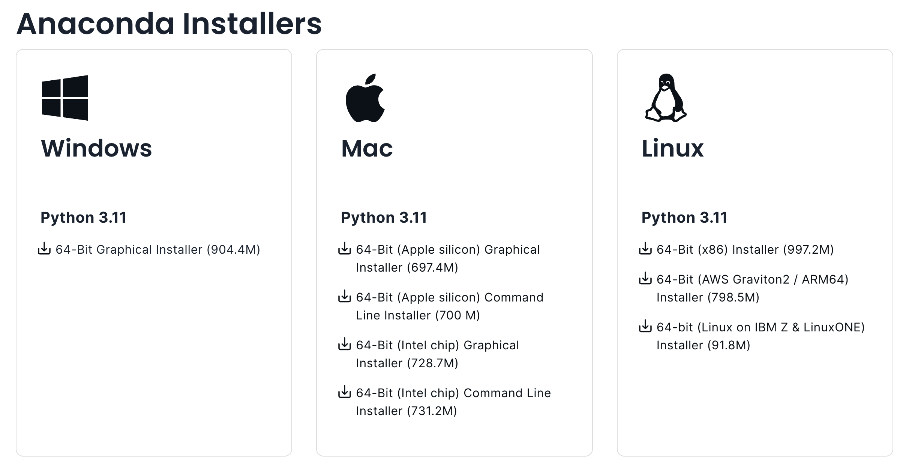
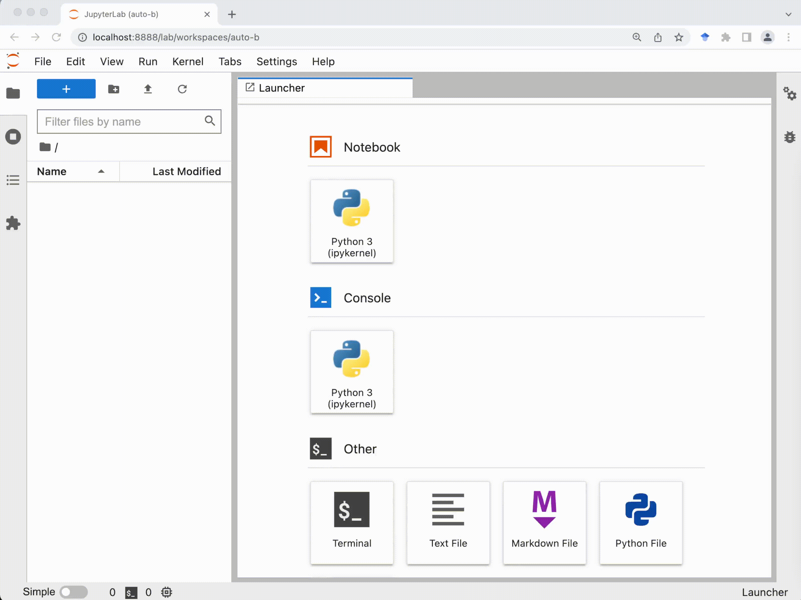

Software setup
==============

In this class we will primarily use `Python <https://www.python.org/>`__ as the programming language and `JupyterLab <https://jupyter.org/>`__ as the integrated development environment (IDE).

To install the above we will use Anaconda, a popular open-source Python distribution bundled with other popular tools (e.g., common Python libraries and JupyterLab). 

Download
--------

Go to the `Anaconda download page <https://www.anaconda.com/download/success>`__.
You will see something similar to the screenshot below.

Download the installer that matches your operating system.

**Mac users**: For most people the Graphical Installer (rather than Command Line Installer) might be the easier option.

Install
-------

For Windows

- Double-click the downloaded file to start the installation. 
- Use all of the defaults for installation except make sure to check *Make Anaconda the default Python*.

For MacOS

- Double-click the downloaded file to start the installation. 
- Use all of the defaults for installation except make sure to check *Make Anaconda the default Python*.

For Linux

- Open a terminal window.
- Type ``bash Anaconda-`` and then press tab. The name of the file you just downloaded should appear. Press **Enter**.
- You will follow the text-only prompts. When there is a colon at the bottom of the screen, press the down arrow to move down through the text. 
- Type ``yes`` and press **Enter** to approve the license. 
- Press **Enter** to approve the default location for the files. 
- Type ``yes`` and press **Enter** to add Anaconda to your PATH (this makes Anaconda the default Python).

.. .. tabs::

..    .. group-tab:: Windows

..       - Double-click the downloaded file to start the installation. 

..       - Use all of the defaults for installation except make sure to check *Make Anaconda the default Python*.

..    .. group-tab:: MacOS

..       - Double-click the downloaded file to start the installation. 

..       - Use all of the defaults for installation except make sure to check *Make Anaconda the default Python*.

..    .. group-tab:: Linux

..       - Open a terminal window.
..       - Type ``bash Anaconda-`` and then press tab. The name of the file you just downloaded should appear. Press **Enter**.
..       - You will follow the text-only prompts. When there is a colon at the bottom of the screen, press the down arrow to move down through the text. 
..       - Type ``yes`` and press **Enter** to approve the license. 
..       - Press **Enter** to approve the default location for the files. 
..       - Type ``yes`` and press **Enter** to add Anaconda to your PATH (this makes Anaconda the default Python).

Launch JupyterLab
------------------

Firstly, you will need to launch your operating system's command-line interface (CLI). 

   - For Windows: Go to the search bar, type in ``anaconda prompt``, and press **Enter**.

      .. image:: images/CLI.png
         :width: 800
         :alt: Command-line interface

   - For MacOS: Go to the Spotlight Search (the magnifying glass icon), type in ``terminal``, and press **return**.

      .. image:: images/terminal-mac.png
         :width: 800
         :alt: Command-line interface

   - For Linux: Go to the search bar, type in ``terminal``, and press **Enter**.

.. .. tabs::

..    .. group-tab:: Windows

..       - Go to the search bar, type in ``anaconda prompt``, and press **Enter**.

..       .. image:: images/CLI.png
..         :width: 800
..         :alt: Command-line interface

..    .. group-tab:: MacOS

..       - Go to the Spotlight Search (the magnifying glass icon), type in ``terminal``, and press **return**.

..       .. image:: images/terminal-mac.png
..         :width: 800
..         :alt: Command-line interface

..    .. group-tab:: Linux

..       - Go to the search bar, type in ``terminal``, and press **Enter**.

Secondly, in the CLI type in the following and press **Enter** or **return**.

.. code:: bash

    jupyter lab

JupyterLab will open automatically in your browser.

Now you should see the Jupter Lab dashboard in your browser (see above). 
You can use the file browser (in the left sidebar Files tab) to navigate the directory to a desired folder, 
and then create a new notebook file for Python by clicking the **Python 3** button under **Notebook**.

In the newly-created Jupyter notebook, try using Python as a calculator by typing ``1 + 2`` in the cell, and click the **Run** button on the tool bar.
If everything's working, you should see the mind-numbingly obvious result of **3** in the output. Congrats!

.. note::

  If you wish to open an existing Jupyter Notebook file (i.e., a file with the **ipynb** extension), first launch JupyterLab, then use the file browser (in the left sidebar Files tab) to navigate to the folder where the file is located, and then double-click on the file to open. 

.. attention::

  To keep the JupyterLab running, you should *not* close the command line window (you can minimize it), as it works as JupterLab's "local host server". 

.. tip::

  If you wish to stop the Jupyter server in the command line, use Control-C (twice to skip confirmation).

.. seealso::

  `An introduction to the JupyterLab interface <https://jupyterlab.readthedocs.io/en/stable/user/interface.html>`__

.. - `JupyterLab official documentations - getting started <https://jupyterlab.readthedocs.io/en/stable/index.html>`__
.. - `Introduction to the JupyterLab interface <https://jupyterlab.readthedocs.io/en/stable/user/interface.html>`__
.. - How to Use JupyterLab - The official 7-min introductory YouTube video

.. .. raw:: html

..   

..     <iframe width="700" height="450" src="https://www.youtube-nocookie.com/embed/A5YyoCKxEOU?rel=0&amp;showinfo=0" frameborder="0" allow="autoplay; encrypted-media" allowfullscreen></iframe>
..   
